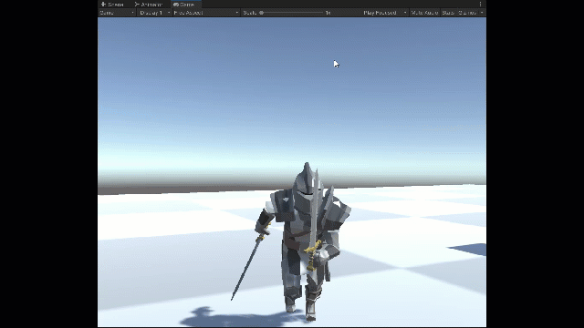
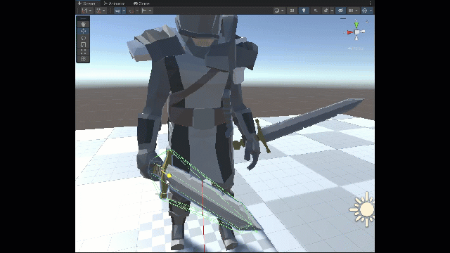
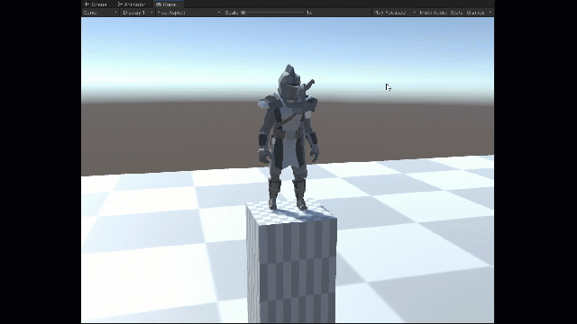

# C# Scripts used in my game development project using Unity Engine.

## What is Scripting in Unity?
```Scripting tells our GameObjects how to behave; it’s the scripts and components attached to the GameObjects, and how they interact with each other, that creates your gameplay. Now, scripting in Unity is different from pure programming. If you’ve done some pure programming, e.g. you created a running app, you should realize that in Unity you don’t need to create the code that runs the application, because Unity does it for you. Instead, you focus on the gameplay in your scripts.```

## Demonstration of my scripts working with GameObjects

  